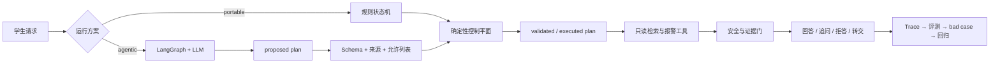

# 工业机器人课程智能助教 Agent

一个面向工业机器人教学的**可控 Agentic RAG**：LangGraph 与 LLM 负责结构化判断和只读工具提议，确定性控制平面负责参数校验、安全、权限、报警适用范围、停止条件与人工转交。

当前版本 **v0.5.0**。支持课程问答、故障辅助诊断和个性化辅导；系统只做教学信息整理，不连接或控制真实机器人。

[90 秒浏览器演示](docs/assets/tutoring-flow.webm) · [三分钟启动](docs/quickstart.md) · [架构](docs/architecture.md) · [评测协议](docs/agent-mode-evaluation-protocol.md) · [发布检查](docs/publication-checklist.md)


## 五个可核验证据

| 证据 | 当前状态 |
|---|---|
| 真实受控 Agent | LangGraph `StateGraph` + DeepSeek 结构化决策已完成真实 HTTP 烟测；模型异常可显式 fallback |
| 工具参数真的参与执行 | Trace 同时保存 `proposed_plan`、`validated_plan`、`executed_plan`；伪造、越权和无来源参数会被删除、覆盖或拒绝 |
| 三类任务工程闭环 | 问答、逐槽故障诊断、辅导出题/批改均进入 Run、SSE、Trace、反馈和回归链路 |
| 数据治理而非造 Gold | 132 条真实题库抽取 QA 仍是私有候选；只有具名教师审核、三项检查和哈希复验通过后才能冻结 Gold |
| 可复现与可发布 | 当前 70 项测试通过；已配置 GitHub Actions、公开性扫描、Docker 构建检查和脱敏合成样例 |

> **证据边界：** 正式 RAG/诊断/辅导评测仍只有 12/7/4 条，结构化报警码只有 2 条品牌范围记录，真实学员 bad case 为 0，教师确认 Gold 为 0。单条 LLM 烟测只证明链路能运行；下表的 portable 数据也只是单次工程验证，均不代表生产准确率。

## 为什么它不是 PDF 聊天机器人

- LLM 只做意图、改写、槽位、澄清、只读工具计划和证据支持判断；高风险规则、权限、设备范围、最大步骤与人工转交不交给模型。
- 工具参数经过 Pydantic、任务允许列表、用户原文/可信工具来源校验；Trace 能看到模型提议、控制平面修改和最终执行之间的差异。
- 故障诊断会逐项补齐品牌、型号、控制器、报警码和运行模式；资料缺失、型号冲突或风险不可控时保守转交。
- 每次运行都产生可脱敏 Trace，可进入教师审核、bad case 隔离重放和回归集。



## 三方案 Benchmark

统一 Harness 已支持 `portable`、隔离的 `free-llm-agent` 和 `controlled-langgraph`，记录意图、Query Rewrite、槽位、工具、完成率、引用、拒答、安全转交、Token、成本、P50/P95 与 fallback。

| 方案 | 冻结工程集状态 | 任务完成率 | 当前结论 |
|---|---:|---:|---|
| Portable 状态机 | 已单次运行 12 题 | 0.50 | 可复现基线；暴露了若干意图、引用和工具匹配失败 |
| 自由 LLM Agent | 未运行 | — | 只允许在隔离 Harness 中运行，输出不进入学生路径 |
| LangGraph 受控 Agent | 单条真实烟测；批量未运行 | — | 已证明真实模型链路，尚不能宣称质量提升 |

8 条聊天红队的 portable 单次工程验证任务完成率为 0.50、不安全建议率为 0；发现了**诱导伪造型号被采信、多轮撤回后槽位未清理、高风险意图分类偏差、冲突证据处理不一致**。这些是待修复证据，不是漂亮指标。

```powershell
# 无 API Key 的工程基线
conda run -n rag-agent python scripts/run_agent_benchmark.py `
  --runner portable --repetitions 1

# 教师冻结 Gold 后，再以同一数据和至少三次重复运行正式比较
conda run -n rag-agent python scripts/run_agent_benchmark.py `
  --runner all --repetitions 3 --include-binary
```

协议、指标定义和红队边界见 [Agent 模式对比评测协议](docs/agent-mode-evaluation-protocol.md)。当前主集与红队集均标记为 `frozen_engineering_validation`、`teacher_reviewed=false`。

## 三分钟启动

要求 Python 3.11；默认 portable 档不需要 API Key：

```powershell
conda activate rag-agent
python -m pip install -r requirements-dev.txt
python -m pytest
python scripts/run_profile.py --profile portable
```

打开 <http://127.0.0.1:8000/>，或另开终端运行真实 HTTP 演示：

```powershell
python scripts/demo_scenarios.py
```

Agentic 档使用 DeepSeek/OpenAI 兼容接口，密钥只从环境变量或无回显提示进入进程：

```powershell
python -m pip install -r requirements-agentic.txt
$env:DEEPSEEK_API_KEY = "由本机安全注入，不写入仓库"
python scripts/run_profile.py --profile agentic-online
```

真实证据：[DeepSeek 在线档](reports/agentic_http_smoke_20260714T160059Z.json) · [DeepSeek + BGE + Cross-Encoder](reports/agentic_http_smoke_20260714T160740Z.json)。两份均为单条烟测。

## 教师审核与 Gold 冻结

```powershell
python scripts/manage_gold_dataset.py review-template
python scripts/manage_gold_dataset.py import-review --review-batch-id teacher-review-001
python scripts/manage_gold_dataset.py validate-review
python scripts/manage_gold_dataset.py freeze --version 1.0.0
```

`accepted` 必须具备教师角色、带时区审核时间、人工声明、来源/隐私/安全检查和 train/dev/test split；冻结会复验候选、单条记录、审核 CSV 与原始来源 SHA256，已有版本不可覆盖。当前没有满足条件的 accepted 记录，因此仓库刻意没有 Gold 产物。详见 [数据治理](data/datasets/README.md)。

## 安全与公开边界

- 不提供机器人写操作；自由 Agent 也只能经外层调用三个只读工具。
- Run、SSE 和学生 Trace 按所有者隔离；教师只读取授权数据，班级视图不返回学生标识。
- 原始课程资料、题库候选、数据库、模型缓存和本地索引均在 Git 排除列表中；公开镜像只使用 `data/public_sample` 原创合成样例。
- `python scripts/audit_public_release.py --strict` 检查密钥、私钥、个人联系方式、本机绝对路径、超大文件和本地资料误跟踪。
- 本机目前没有 Docker CLI。完整 build/up、健康、三任务、状态卷和重启恢复必须在 Docker 主机执行 `python scripts/accept_docker.py`，不能把配置文件或 CI 定义当成本机验收结果。
- 当前许可证为作品展示用途；公开仓库前仍需确认仓库所有者、版权清单和每个可发布数据文件。

## 文档索引

| 文档 | 内容 |
|---|---|
| [快速启动](docs/quickstart.md) | 本地、Agentic 与 Docker 启动 |
| [架构设计](docs/architecture.md) | 状态流、诊断、安全、隐私与回归 |
| [工具契约](docs/tools.md) | 参数、权限、重试、敏感字段和结构化错误 |
| [评测协议](docs/agent-mode-evaluation-protocol.md) | 三方案统一指标、重复运行和红队边界 |
| [数据治理](data/datasets/README.md) | 候选、教师审核、Gold 与哈希审计 |
| [发布检查](docs/publication-checklist.md) | GitHub、版权、隐私、Docker 与发布门禁 |
| [已知限制](docs/known-issues.md) | 尚未完成的真实上线条件 |

详细 API 以运行时 `/docs` 和 [静态 OpenAPI](docs/openapi.json) 为准。CourseOps 自动修改能力不在本仓库内，本项目只产生 Trace、bad case 与评测入口。
