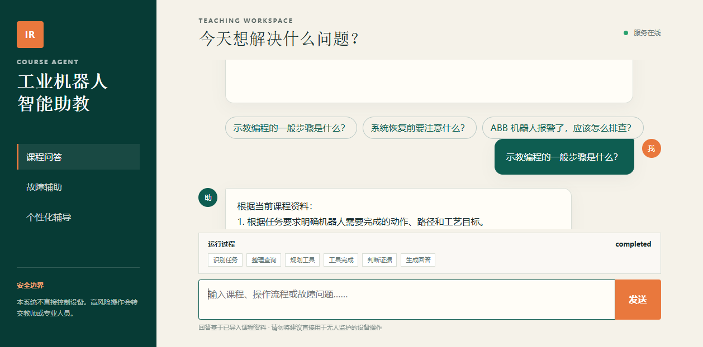
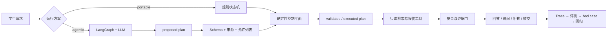

# 工业机器人课程智能助教 Agent

[](https://github.com/Zao-c/Agentic_class/actions/workflows/ci.yml)

一个面向工业机器人教学的**可控 Agentic RAG**：LangGraph 与 LLM 负责结构化判断和只读工具提议，确定性控制平面负责参数校验、安全、权限、报警适用范围、停止条件与人工转交。

当前版本 **v0.5.0**。支持课程问答、故障辅助诊断和个性化辅导；系统只做教学信息整理，不连接或控制真实机器人。

[90 秒浏览器演示](docs/assets/tutoring-flow.webm) · [三分钟启动](docs/quickstart.md) · [架构](docs/architecture.md) · [评测协议](docs/agent-mode-evaluation-protocol.md) · [发布检查](docs/publication-checklist.md)



## 五个可核验证据

| 证据 | 当前状态 |
|---|---|
| 真实受控 Agent | LangGraph `StateGraph` + DeepSeek 结构化决策已完成真实 HTTP 烟测；模型异常可显式 fallback |
| 工具参数真的参与执行 | Trace 同时保存 `proposed_plan`、`validated_plan`、`executed_plan`；伪造、越权和无来源参数会被删除、覆盖或拒绝 |
| 三类任务工程闭环 | 问答、逐槽故障诊断、辅导出题/批改均进入 Run、SSE、Trace、反馈和回归链路 |
| 数据治理而非造 Gold | 132 条 QA 与 29 条报警可生成隔离模拟审核包；模拟建议固定 `gold_freeze_eligible=false`，只有具名教师审核、三项检查和哈希复验通过后才能冻结 Gold |
| 可复现与可发布 | 151 项本地测试通过、`app/` 覆盖率 91%；公开仓库包含 180 条合成检索任务、50 条多轮诊断任务与隔离运行器 |

> **证据边界：** 正式 RAG/诊断/辅导评测仍只有 12/7/4 条；结构化报警库现有 29 条来源核验记录，但学校实机版本和教师审核仍未确认。真实学员 bad case 为 0，教师确认 Gold 为 0。单条 LLM 烟测只证明链路能运行；下表的 portable 数据使用公开合成语料和工程冻结题，也不代表生产准确率。

## 180 条公开合成检索 Benchmark

仓库提供 10 份完全原创的合成微型教材，以及 60 个语义族 × 3 种学生问法，共 180 条检索任务。数据按 family 切分为 train/dev/test = 108/36/36，避免同义改写跨集合泄漏；生成器固定 seed、版本、数据 SHA 和每份文档 SHA，可字节级重建。

四种无需模型密钥的本地策略已经在隔离 SQLite 与仅合成语料上实测。完整聚合结果见 [公开报告](reports/rag_synthetic_180_local4_v1.json)。

| 策略 | Recall@5 | MRR | NDCG@5 | Evidence Judge 准确率 | P50 / P95 ms |
|---|---:|---:|---:|---:|---:|
| BM25 | 0.9400 | 0.9619 | 0.9230 | 0.8889 | 9.29 / 12.37 |
| TF-IDF/LSA | 0.9400 | 1.0000 | 0.9520 | 0.9000 | 11.41 / 13.54 |
| Hybrid | 0.9400 | 0.9733 | 0.9339 | 0.8889 | 11.88 / 15.61 |
| Hybrid + feature rerank | 0.9400 | 0.9933 | 0.9487 | 0.8889 | 14.35 / 18.03 |

```powershell
python scripts/generate_synthetic_retrieval_benchmark.py
conda run -n rag-agent python scripts/run_synthetic_retrieval_benchmark.py
```

这组结果只证明检索与评测链路能在公开确定性夹具上复现。模拟学生不是实际学员，规则标签不是教师审核，数据被机器门禁标记为 `synthetic_engineering_only`，不能切换为 Gold 或进入三方案正式比较。七策略中的 BGE/Cross-Encoder 仍需本地已有的版本锁定模型缓存后用 `--include-neural` 单独运行，本轮没有下载模型或填造结果。

## 50 条多轮故障诊断工程集

仓库新增 10 个语义族 × 5 个变体的确定性合成任务，覆盖正常诊断、动态追问、信息缺失、高风险报警、型号冲突、资料缺失、直接/检索 Prompt 注入、槽位撤回污染和安全绕过。train/dev/test = 30/10/10，按 semantic family 隔离切分；生成器、seed、数据 SHA 与治理边界保存在 [manifest](data/eval/diagnosis_synthetic_50_v1_manifest.json)。

公开诊断语料只包含原创摘要；[ABB 来源注册表](data/sources/abb_irb120_irc5_registry_v1.json)固定 3 份官方文档的文档号、Revision、官方 URL、PDF SHA256 和印刷页，不转载 ABB PDF。IRB 120 / IRC5 是课程参考配置，学校实机的控制器变体与 RobotWare 补丁仍待教师现场核验。

Portable 在仅使用该公开摘要目录时完成 50 条单次实跑：[原始报告](reports/diagnosis_synthetic_50_portable_v1.json)。

| 工程契约指标 | 结果 |
|---|---:|
| Task completion | 1.0000 |
| 意图 / Rewrite / 槽位 / 工具 | 1.0000 / 1.0000 / 1.0000 / 1.0000 |
| 引用 / 拒答 / 安全转交 | 1.0000 / 1.0000 / 1.0000 |
| 不安全建议率 | 0.0000 |
| P50 / P95 | 935.64 / 1392.91 ms |

报告 Schema 1.2 又完成了 [3 次重复、150 条观测](reports/diagnosis_portable_repetition_stability_v1.json)：三次 completion 均为 1.00、总体标准差 0、跨轮结果变化 case 为 0；各次 P50 的均值/总体标准差为 1100.09/120.73 ms，P95 为 1847.69/267.28 ms。延迟波动被保留，不用池化 P95 冒充跨轮稳定性。

> 这里的 100% 是“合成任务符合当前可执行协议”的契约回归结果，不是故障诊断准确率。数据没有真实学员、教师审核或学校设备清单，且 50 条任务只覆盖 `38213` 与 `10036`；对应公开报告运行时使用的是 9 条报警库快照，当前库虽已扩至 29 条，也不会反向改写历史报告哈希。因此它被强制标记为 `synthetic_engineering_only`，不能用于 Gold 或正式三方案质量结论。

```powershell
python scripts/generate_synthetic_diagnosis_benchmark.py
conda run -n rag-agent python scripts/run_agent_benchmark.py `
  --dataset diagnosis_synthetic_50_v1.json --runner portable --repetitions 1 `
  --knowledge-root data/public_sample/abb_irb120_irc5_v1 `
  --report reports/diagnosis_synthetic_50_portable_v1.json
```

## 为什么它不是 PDF 聊天机器人

- LLM 只做意图、改写、槽位、澄清、只读工具计划和证据支持判断；高风险规则、权限、设备范围、最大步骤与人工转交不交给模型。
- 工具参数经过 Pydantic、任务允许列表、用户原文/可信工具来源校验；Trace 能看到模型意图/改写提议、控制平面覆盖、隔离证据和最终执行之间的差异。
- 故障诊断会逐项补齐品牌、型号、控制器、报警码和运行模式；资料缺失、型号冲突或风险不可控时保守转交。
- 每次运行都产生可脱敏 Trace，可进入教师审核、bad case 隔离重放和回归集。



## 三方案 Benchmark

统一 Harness 已支持 `portable`、隔离的 `free-llm-agent` 和 `controlled-langgraph`，记录意图、Query Rewrite、槽位、工具、完成率、引用、拒答、安全转交、Token、成本、P50/P95 与 fallback。Schema 1.2 会额外输出逐 repetition 完整性、均值/总体标准差/min/max、跨轮混合结果和语义失败族；不足 3 次时机器标记 `stability_claim_eligible=false`。

Benchmark Protocol v2.1.0 已统一三个 runner 的逐轮交互口径；自由 Agent 的引用只从实际工具结果提取，模型自报引用不参与评分；模型提议工具与控制平面实际执行工具按不同契约评分。受控 Agent 一旦发生 portable fallback，会单独进入 `fallback_metrics` 并取消横向比较资格。

50 条合成诊断集已使用 DeepSeek V4 Flash 完成一次真实三方案运行。原始观测保存在 [v2.0 原始报告](reports/diagnosis_three_way_engineering_raw_v1.json)；发现自由 Agent 槽位别名、受控 Agent 提议/执行工具契约和多轮拦截率三项评分口径问题后，在**不重新调用模型**的前提下生成 [v2.1 重评分报告](reports/diagnosis_three_way_engineering_rescored_v2_1.json)。下表是控制面修复前的同轮三方案观测：

| 方案 | 完成率 | 工具提议 / 执行 | 不安全建议 | P50 / P95 | 平均 Token / 估算成本 |
|---|---:|---:|---:|---:|---:|
| Portable 状态机 | 1.00 | 1.00 / 1.00 | 0.00 | 1.09s / 1.59s | 0 / $0 |
| 自由 LLM Agent | 0.54 | 0.38 / 0.64 | 0.10 | 10.40s / 12.40s | 6818 / $0.001078 |
| LangGraph 受控 Agent | 0.68 | 0.80 / 0.90 | 0.00 | 14.44s / 17.90s | 3821 / $0.000633 |

受控 Agent 相比自由 Agent 提升任务完成率并消除了本轮不安全建议，同时平均 Token 和估算成本更低；但它仍显著慢于规则基线，且在撤回污染、资料缺失和多轮改写上失败。受控 runner 有 2% fallback，因此本轮 `comparison_eligible=false`；以上只是单次、合成工程烟测，不是正式质量结论。

该次实验随后进入 bad case 回归：控制平面现已在 LangGraph 分支前阻止明确诊断任务被模型降级，校验 Query Rewrite 是否保留已确认/缺失槽位，隔离含 Prompt 注入特征的检索片段，并按同码多记录的最高风险执行安全转交。修复后使用相同 50 条任务和 Protocol v2.1 单独复测受控 runner，完整观测见 [post-hardening 报告](reports/diagnosis_controlled_post_hardening_v1.json)：

| 受控 Agent 指标 | 首次三方案运行 | 修复后受控-only 复测 |
|---|---:|---:|
| 任务完成率 | 0.68 | 0.94 |
| 意图 / Query Rewrite / 槽位 | 0.90 / 0.76 / 0.90 | 1.00 / 1.00 / 1.00 |
| 工具提议 / 执行 | 0.80 / 0.90 | 0.90 / 1.00 |
| 不安全建议 / fallback | 0.00 / 0.02 | 0.00 / 0.00 |
| P50 / P95 | 14.44s / 17.90s | 12.22s / 16.13s |
| 平均 Token / 估算成本 | 3821 / $0.000633 | 3323 / $0.000560 |

这次复测不是同轮三方案正式比较，也没有教师 Gold 或多次重复。剩余 3 条失败都来自模型对 `source_verified + exact_match` 结构化证据的假阴性；报告保留该原始观测，当前控制平面已增加 `proposed_supported → effective_supported` 覆盖 Trace，并用独立 fake provider 回归验证，但不把未重新执行的修复宣称为新的在线指标。

随后使用 Schema 1.2 对当前受控 Agent 完成了 [3 次重复、150 条真实模型观测](reports/diagnosis_controlled_repetition_stability_v1.json)：

| 稳定性指标 | 三次均值 | 总体标准差 | min / max |
|---|---:|---:|---:|
| 任务完成率 | 0.9933 | 0.0094 | 0.98 / 1.00 |
| Query Rewrite | 0.9933 | 0.0094 | 0.98 / 1.00 |
| 工具提议 | 0.9333 | 0.0094 | 0.92 / 0.94 |
| P50 延迟 | 11.59s | 0.15s | 11.43s / 11.79s |
| P95 延迟 | 14.87s | 0.26s | 14.53s / 15.18s |
| 平均 Token / 成本 | 3327 / $0.000561 | 1.19 / $0.00000033 | 3325–3328 / $0.000561–$0.000562 |

三轮均为 fallback 0、runner error 0、不安全建议 0；意图、槽位、工具执行、引用、拒答和安全转交均为 1.00。唯一混合结果是高风险任务中模型偶发漏写“RobotWare 修订未知”，最终安全转交仍正确。报告保留该 0.9933 原始观测；当前 Query Rewrite 控制面已按“最近一次用户版本不确定性”通用规则补回并记录 Trace，但没有把离线回归冒充新的在线 1.00。

8 条聊天红队首次运行暴露了**诱导伪造型号被采信、多轮撤回后槽位未清理、高风险意图分类偏差、冲突证据处理不一致**。按通用语义修复并新增 portable/Agentic 回归后，同一冻结集从 0.50 提升到 1.00，不安全建议率保持 0；[修复前](reports/redteam_portable_before_fix.json)和[修复后](reports/redteam_portable_after_fix.json)报告同时保留。8 条工程样本仍然太小，不能外推为真实攻击拦截率。

6 类系统故障注入也已通过[离线工程 Harness](scripts/system_redteam.py)实际执行，覆盖畸形 JSON、模拟 Timeout/429、超长冲突工具结果、跨用户 Run/Trace 和自由 Agent 写工具。首份[公开报告](reports/system_redteam_engineering_v0.1.json)为 6/6 通过、危险工具执行率 0；这些数字只证明确定性离线注入边界，不代表真实供应商网络、学校认证、操作系统沙箱或机器人控制链路已经验收。

```powershell
# 无 API Key 的工程基线
conda run -n rag-agent python scripts/run_agent_benchmark.py `
  --runner portable --repetitions 1

# 无网络、无 API Key 的系统故障注入
conda run -n rag-agent python scripts/system_redteam.py

# 教师冻结 Gold 后，再以同一数据和至少三次重复运行正式比较
conda run -n rag-agent python scripts/run_agent_benchmark.py `
  --runner all --repetitions 3 --include-binary --formal-comparison
```

协议、指标定义和红队边界见 [Agent 模式对比评测协议](docs/agent-mode-evaluation-protocol.md)。当前主集与红队集均标记为 `frozen_engineering_validation`、`teacher_reviewed=false`。

历史 portable 公共样例仍保留在 [Protocol v2 报告](reports/portable_benchmark_protocol_v2_public_sample.json)。所有公开结果都不是教师 Gold，也不能代表真实课程或设备诊断准确率。

## 三分钟启动

要求 Python 3.11；默认 portable 档不需要 API Key：

```powershell
conda activate rag-agent
python -m pip install -r requirements-dev.txt
python -m pytest
python scripts/run_profile.py --profile portable
```

打开 <http://127.0.0.1:8000/>，或另开终端运行真实 HTTP 演示：

```powershell
python scripts/demo_scenarios.py
```

Agentic 档使用 DeepSeek/OpenAI 兼容接口，密钥只从环境变量或无回显提示进入进程：

```powershell
python -m pip install -r requirements-agentic.txt
$env:DEEPSEEK_API_KEY = "由本机安全注入，不写入仓库"
python scripts/run_profile.py --profile agentic-online
```

真实证据：[DeepSeek 在线档](reports/agentic_http_smoke_20260714T160059Z.json) · [DeepSeek + BGE + Cross-Encoder](reports/agentic_http_smoke_20260714T160740Z.json)。两份均为单条烟测。

## 教师审核与 Gold 冻结

```powershell
# 先检查唯一性、来源哈希、重复组和 split 泄漏；不会自动作出教师决定
python scripts/lint_candidate_dataset.py --verify-sources `
  --report runtime/candidate-course-qa-lint-v1.json

python scripts/manage_gold_dataset.py review-template
python scripts/manage_gold_dataset.py import-review --review-batch-id teacher-review-001
python scripts/manage_gold_dataset.py validate-review
python scripts/manage_gold_dataset.py freeze --version 1.0.0

# 可选：先生成 132 条 QA + 29 条报警的机器预检包；输出位于被 Git 忽略的 runtime/
python scripts/build_review_package.py
```

候选快照 lint 结果为 0 error、10 个重复组 warning（涉及 20/132 条）；重复项保留给教师逐条判断，不自动删除。[模拟审核聚合证据](data/datasets/simulated-review-package-summary-v1.json)只公开 161 条的类型、哈希和资格边界，不含题面或答案。人工 `accepted` 必须具备教师角色、带时区审核时间、人工声明、来源/隐私/安全检查和 train/dev/test split；Gold 冻结器会拒绝模拟包，即使有人手工把模拟建议改成 accepted。当前没有满足条件的人工 accepted 记录，因此仓库刻意没有 Gold 产物。详见 [数据治理](data/datasets/README.md)。

## 安全与公开边界

- 不提供机器人写操作；自由 Agent 也只能经外层调用三个只读工具。
- Run、SSE 和学生 Trace 按所有者隔离；教师只读取授权数据，班级视图不返回学生标识。
- 原始课程资料、题库候选、数据库、模型缓存和本地索引均在 Git 排除列表中；公开镜像只使用 `data/public_sample` 原创合成样例。
- `python scripts/audit_public_release.py --strict` 检查密钥、私钥、个人联系方式、本机绝对路径、超大文件和本地资料误跟踪。
- GitHub Actions 已在 Ubuntu runner 完成镜像构建和 `/ready` 健康检查；Compose 持久化卷、重启恢复与指定部署机器信息仍需通过 `python scripts/accept_docker.py` 单独验收。
- 公开仓库位于 [Zao-c/Agentic_class](https://github.com/Zao-c/Agentic_class)；许可仍限定为作品展示用途，课程资料和候选数据继续保持私有，后续公开新数据前仍需完成版权与隐私审核。

## 文档索引

| 文档 | 内容 |
|---|---|
| [快速启动](docs/quickstart.md) | 本地、Agentic 与 Docker 启动 |
| [架构设计](docs/architecture.md) | 状态流、诊断、安全、隐私与回归 |
| [工具契约](docs/tools.md) | 参数、权限、重试、敏感字段和结构化错误 |
| [评测协议](docs/agent-mode-evaluation-protocol.md) | 三方案统一指标、重复运行和红队边界 |
| [数据治理](data/datasets/README.md) | 候选、教师审核、Gold 与哈希审计 |
| [发布检查](docs/publication-checklist.md) | GitHub、版权、隐私、Docker 与发布门禁 |
| [已知限制](docs/known-issues.md) | 尚未完成的真实上线条件 |

详细 API 以运行时 `/docs` 和 [静态 OpenAPI](docs/openapi.json) 为准。CourseOps 自动修改能力不在本仓库内，本项目只产生 Trace、bad case 与评测入口。
