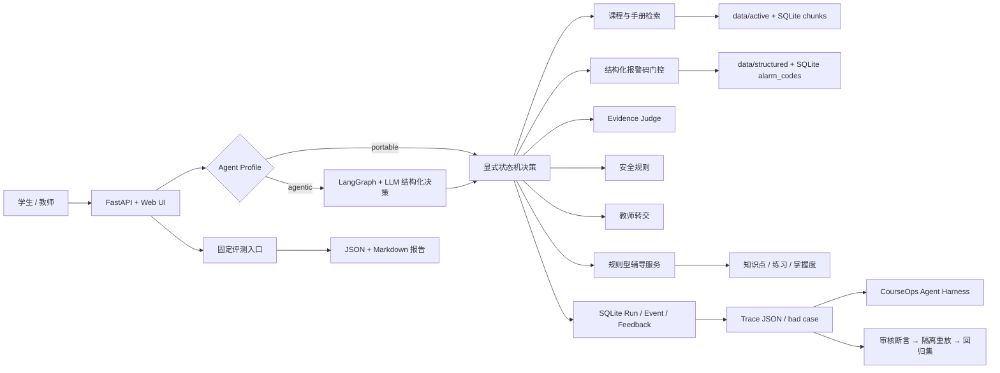
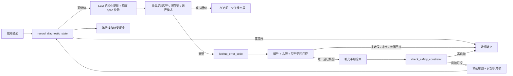
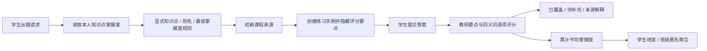
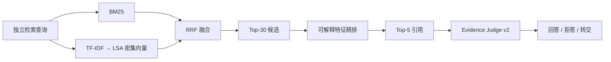
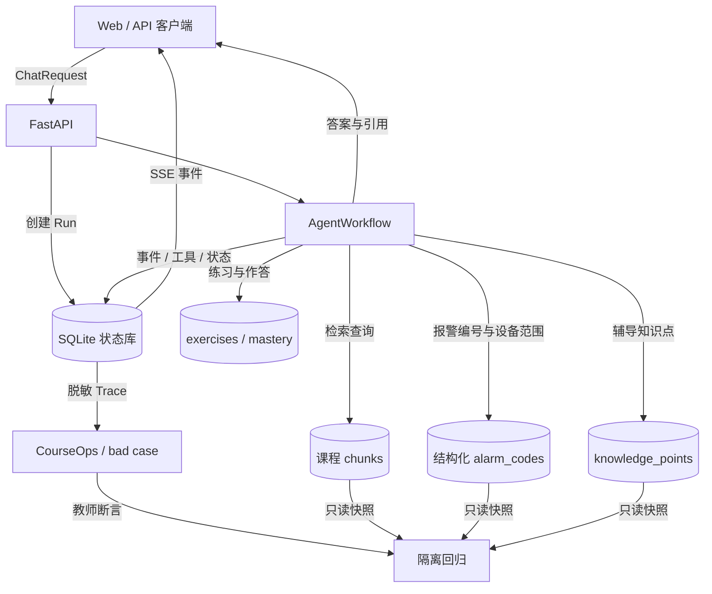
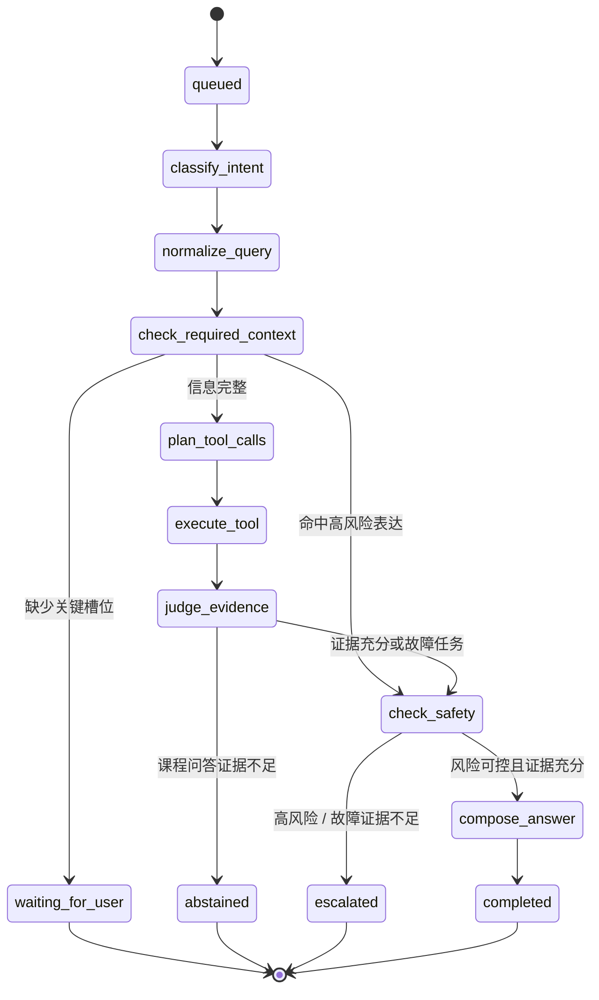
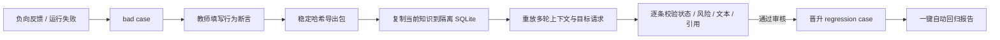

# 系统架构与状态流

## 组件关系

LangGraph 是模型决策平面，显式状态机是确定性控制平面。模型节点只负责意图、查询重写、槽位提议、澄清问题、只读工具计划和证据支持判断；安全预检、关键实体原文校验、工具允许列表、报警适用范围、最终证据门、转交和权限不交给模型。工具计划按 `proposed_plan → validated_plan → executed_plan` 进入 Trace，只有通过 Schema、任务允许列表和字段来源检查后的参数才可能参与真实执行。

## 故障诊断链路

结构化报警码是决定能否继续诊断的主证据；通用 RAG 只补充来源，不得覆盖结构化范围冲突。

## 个性化辅导链路

## 检索链路

## 请求与数据流

## 有限状态机

状态最多执行 `MAX_AGENT_STEPS` 次控制平面转移；Trace 事件数量不再冒充状态步数。Agentic 图还使用 LangGraph `recursion_limit`。每次模型决策记录 Schema、结构化输出、简短依据、字段来源、Token、估算成本、耗时、尝试次数和 fallback；每个工具调用记录名称、实际参数、逐参数来源与校验状态、耗时、重试和结构化错误。模型提议被覆盖或拒绝时，Trace 保留原提议与机器可读调整原因。

## 访问与隐私

- Run 和 SSE 必须使用创建请求时的 `user_id`，其他用户返回 403。
- Trace 对学生仅开放自己的请求；教师和维护者可读取。
- Trace 导出对用户 ID 做 SHA-256 截断匿名化，并脱敏手机号和邮箱。
- Trace、反馈、bad case 标签和工具事件中的字符串均递归脱敏。
- 班级学习与掌握度视图只返回知识点、结果、人数和统计值，不包含学生标识。
- 学生可读取和清除自己的学习记录、练习、作答和掌握度。
- 该删除接口不是全量账户数据删除；Run、事件、反馈和 bad case 仍受单独保留策略约束。
- 学生答题前的知识点和练习接口不返回内部评分要点。

## Bad case 回归流

重放目录由应用在 `runtime/replays` 下显式创建并继承父目录权限，结束后只删除本次 UUID 子目录。正式数据库不写入重放 run、事件或学习记录。
