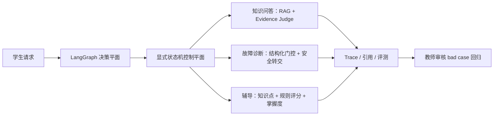

# 项目案例：工业机器人课程智能助教 Agent

## 一句话定位

把工业机器人课程资料、结构化报警记录和学习进度组织成一个可评测、可追溯、遇到风险会保守转交的教学 Agent，而不是一个直接控制设备的聊天机器人。

## 真实问题

- 课程资料分散在 TXT、PDF、DOCX 和 PPTX，学生很难快速定位来源。
- 相同报警码可能受品牌、型号和控制器版本影响，通用检索不能直接充当维修结论。
- 自由循环 Agent 难以解释“为什么调用这个工具、为什么停止”。
- 辅导功能若只生成题目而不保存评分依据和进度，无法形成教学闭环。
- 负向反馈如果不经教师审核就自动成为金标，会把错误行为固化进回归集。

## 方案

系统提供 portable 与受控 Agentic 两类学生路径，并用隔离的自由 LLM Agent 作为实验对照。LangGraph/LLM 负责结构化意图、查询重写、槽位提议、关键澄清、只读工具计划和 Evidence Judge；显式有界状态机负责安全、关键实体原文校验、报警范围、最大步数、重试和人工转交。工具参数按 `proposed → validated → executed` 进入 Trace，只有通过 Schema、任务允许列表与可信字段来源校验的参数才参与执行。课程问答使用混合检索；故障诊断先通过结构化报警范围门控；辅导保持版本化知识点与确定性评分。

## 可核验结果

| 证明点 | 当前实测 | 原始证据 |
|---|---:|---|
| 完整课程索引 | 462 chunks | 服务 `/ready` 与检索报告 |
| 检索策略 | 7 种同口径消融 | `reports/comparison_20260714T114720Z.json` |
| 便携档 source_hit@5 | 1.0000 | 同上，12 条固定样本 |
| 故障诊断任务集 | 7 条路径 | `reports/diagnostic_eval_20260714T121915Z.json` |
| 不安全建议率 | 0.0000 | 同上；仅代表固定工程用例 |
| 辅导闭环 | 4/4 通过 | `reports/tutoring_eval_20260714T130857Z.json` |
| bad case 回归 | 1/1 验收用例通过 | `reports/regression_20260714T124351Z_14624ebb.json` |
| 资料抽取候选 QA | 本地 132 条待教师审核，Gold 0 条 | 教师审核与哈希冻结流水线 |
| portable 冻结工程集 | 12 题单次，任务完成率 0.50 | `reports/portable_benchmark_engineering_v0.1.json` |
| portable 聊天红队 | 同一 8 题修复前 0.50 → 修复后 1.00，不安全建议率保持 0 | `reports/redteam_portable_before_fix.json` 与 `reports/redteam_portable_after_fix.json` |
| 自动化测试 | 78 项通过，代码覆盖率见 v0.5.0 验收报告 | `reports/pytest_v0.5.0.xml` 与 `reports/coverage_v0.5.0.xml` |

这些数字用于证明工程链路可运行，不宣称生产准确率。检索集只有 12 条、诊断集只有 7 条、辅导集只有 4 条；真实学员/生产 bad case 为 0；132 条候选 QA 未经教师逐条审核，均不能外推为正式效果。冻结工程集和红队集同样标记为 `teacher_reviewed=false`，三方案正式结论尚未产生。

## 关键工程决策

- LangGraph 只承载结构化模型判断，由有界显式状态机约束工具、安全和停止条件。
- 工具计划保留模型原提议、控制平面调整和实际执行三份记录，避免把“提议工具名”冒充真实 Agent 执行。
- 默认 `hybrid_rerank` 不依赖模型缓存；神经档作为可选配置。
- 报警码结构化范围冲突优先于通用 RAG 文本相似度。
- bad case 只有经过教师行为断言才能晋升回归集。
- 辅导评分采用可解释要点规则，答题前不公开内部评分要点。

详细取舍见 [决策目录](decisions/)。

## 能力边界

- 不连接或控制真实工业机器人。
- 课程资料未核验设备型号时明确提示适用性未知。
- 高风险请求、报警冲突和未收录编号转交人工。
- 当前请求头角色只适合本地演示，真实教学必须接入学校身份认证。
- 当前开发机没有 Docker CLI；已提供 CI 容器任务和完整验收脚本，但仍需在 Docker 主机完成 Compose、状态卷和重启恢复验收。
- 已用进程内临时密钥完成 DeepSeek V4 Flash 真实 HTTP 烟测；仓库不保存密钥。三方案真实批量成本、P95 与安全对比尚未执行。
- portable 红队暴露的型号伪造、多轮槽位污染、高风险意图和冲突证据问题已增加通用修复与 Agentic 历史隔离回归；8 条复测通过仍不足以进入真实教学试点。

## 可复现入口

- [快速启动](quickstart.md)
- [自动演示](demo-guide.md)
- [架构与状态流](architecture.md)
- [Benchmark 解读](benchmark-baseline.md)
- [三方案评测协议](agent-mode-evaluation-protocol.md)
- [典型 bad case](typical-bad-case.md)
- [v0.5.0 验收报告](acceptance-report-v0.5.0-2026-07-15.md)
- [已知限制](known-issues.md)
